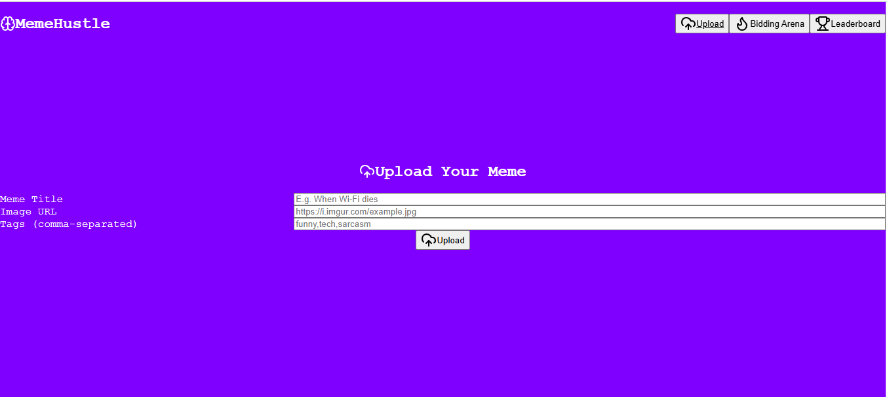
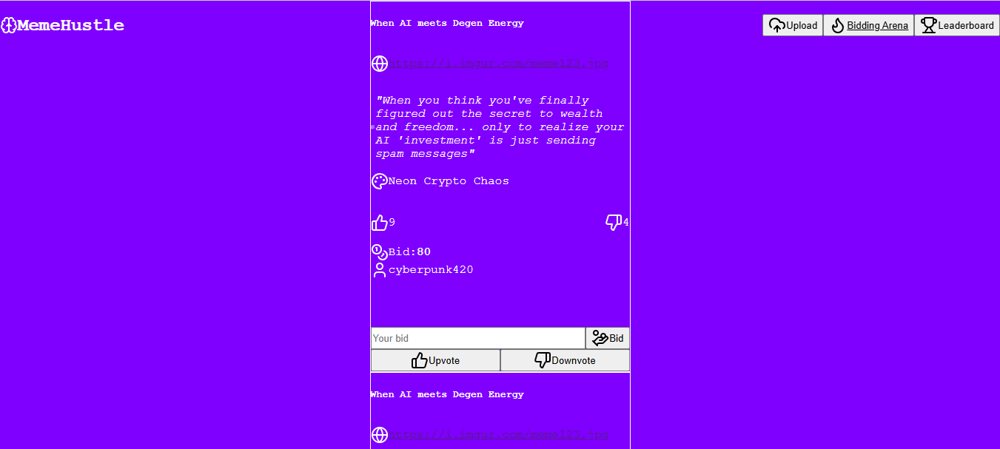
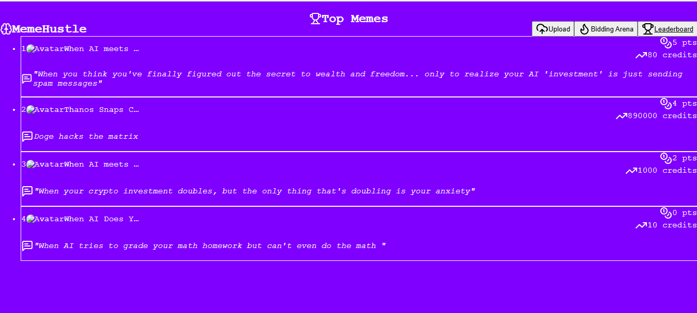
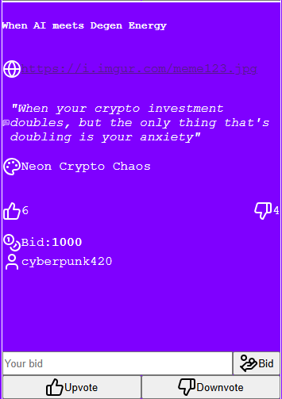

# MemeHustle

> _"Where memes meet the marketplace — powered by AI, vibes, and real-time bidding."_  
>  React + Node + Supabase + Ollama + WebSockets

---

## Project Overview

**MemeHustle** is a real-time, AI-powered meme marketplace built for creators, traders, and internet culture enthusiasts.

Users can:
- **Upload memes** with titles, tags, and images.
- **Auto-generate captions and vibe analysis** using Ollama or Gemini AI.
- **Bid on memes** in real time via WebSockets.
- **Vote for your favorite memes**.
- **Track leaderboard rankings** by popularity and bid wars.

---

## 🚀 Live Demo

Check out the live deployed version of MemeHustle here:

👉 [https://memehustle-client.vercel.app/](https://memehustle-client.vercel.app/)

---

## 📸 Screenshots

### ✨ Meme Upload Form

### 🔥 Real-Time Bidding Interface

### 🏆 Leaderboard View

### ✨ Meme Display Card

---

## 🛠 Tech Stack

| Layer         | Technology                          |
|---------------|--------------------------------------|
| Frontend      | Vite + React + Tailwind CSS          |
| Backend       | Node.js + Express + Socket.IO        |
| Realtime DB   | Supabase (PostgreSQL)                |
| AI Services   | Ollama (Local LLM)                   |
| Hosting       | Vercel / Render                      |
| Version Ctrl  | Git + GitHub                         |

---

## ✅ Features

- ⚡ Instant meme uploads with smart AI-generated captions
- 🧠 Vibe classification using Ollama or Gemini AI
- 🟢 Real-time bidding wars powered by WebSockets
- 👍 Voting system to promote top-tier memes
- 🏆 Dynamic leaderboard based on popularity & bids
- 🧪 Dev-friendly architecture using modern tech stack

---

## 🧠 AI Integration

I have used Ollama for this project. 
Reason: AI API keys were costly. So, I deployed ollama on a local server, created the endpoints and used it in my project. In order to integrate AI features.
